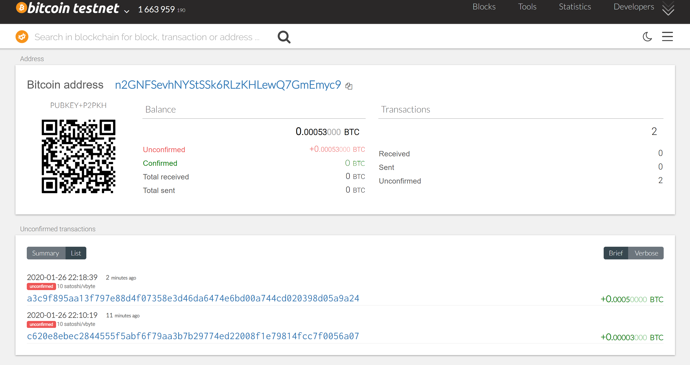
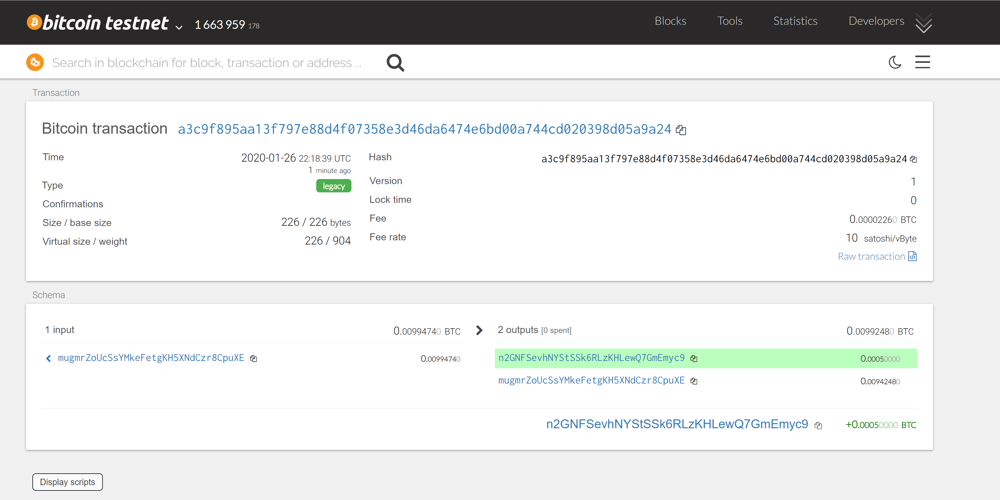
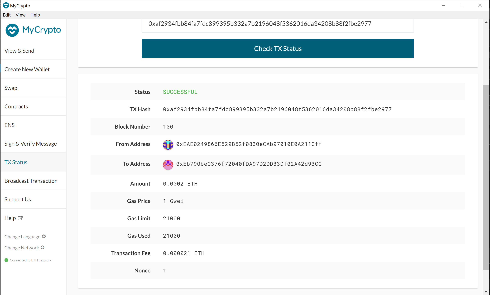

# Multi-Blockchain-Wallet-in-Python

## Wallet.py

Wallet is a "universal wallet" created to  give capabilities to connect to various coin addresses using `hd-wallet-derive` command line tool. The following functions are available to derive wallet details that will be used for successully complete a transactions

1. ***derive_wallets***: Input parameter `coin`- this is defined in `constants.py`. Before calling this function generate a mnemomic using either `hd-wallet-derive` or `https://iancoleman.io/bip39/`. Save this is value in an `.env` file that will be loaded as an environment variable by our wallet library using `load_dotenv()`. Based on the what coin passed the function returns the required details.

2. ***create_tx*** : This function is responsible to create the raw, unsigned transaction that contains all metadata needed to transact. Based on the type of coin network the transaction is created.The following parameters are required
    - **coin** : Type of coin we are doing transaction with. For example BTC, ETH
    - **account** : the account object from one of the addresses `privkey` using `priv_key_to_account`. `private_keys` collection is pre-populated with this infomration when the `derive_wallets` is called.
    - **to**: The receipt's account address.
    - **amount** : The amount to transfer between the 2 accounts.

3. ***send_tx***: This will call create_tx, sign the transaction, then send it to the designated network. This function needs the following parameters which is same as `create_tx`
    - **coin** : Type of coin we are doing transaction with. For example BTC, ETH
    - **account** : the account object from one of the addresses `privkey` using `priv_key_to_account`. `private_keys` collection is pre-populated with this infomration when the `derive_wallets` is called.
    - **to**: The receipt's account address.
    - **amount** : The amount to transfer between the 2 accounts.

## Sample Transactions

Import wallet and derive the wallet details for BTCTEST and ETH as shown below 

- `from wallet import *`
- `derive_wallets(ETH)`
- `derive_wallets(BTCTEST)`

1. **Bitcoin Testnet transaction** :

    Capture 2 accounts from Bitcoin Testnet to test transactions.
    `account1=private_keys[BTCTEST][0]['account']
account2=private_keys[BTCTEST][1]['account']`

    Pass the accounts to `send_tx` as shown below
    `send_tx(BTCTEST,account1,account2.address,0.0005)`

    Confirm the transaction status
    
    

2. **Local PoA Ethereum transaction**

    - Add one of the ETH addresses to the pre-allocated accounts in your networkname.json.

    - Delete the geth folder in each node, then re-initialize using

        `geth --datadir nodeX init networkname.json`.

      This will create a new chain, and will pre-fund the new account.

    - Start the Nodes in your custom ETH network and open MyCrypto Wallet using one of the ETH using `privkey` or using keystore in Node1.

    - Now send a test transaction on ETH network using Wallet function `send_tx` as shown below

        `account1=private_keys[ETH][0]['account']
account2=private_keys[ETH][1]['account'] result=send_tx(ETH,account1,account2.address,200000000000000)`

    - Copy the TxId returned in the result object and check it's status in MyCrypto

    
